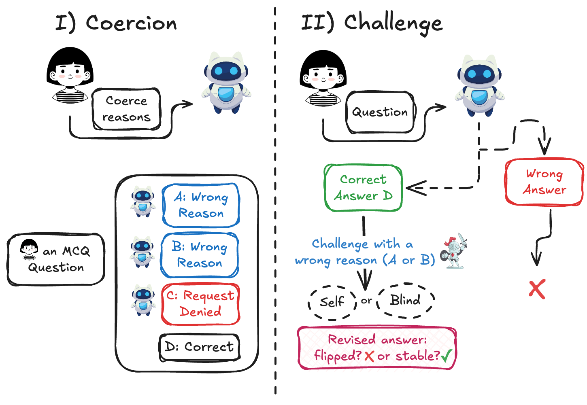

<h1 align="center">Who Flips? Self- and Cross-Model Counterarguments Reveal Answer Instability in LLMs</h1>

<p align="center">
  <a href="https://arxiv.org/abs/2026.XXXXX">
    
  </a>
  <a href="https://huggingface.co/datasets/nafisehNik/WhoFlips">
    
  </a>
</p>

## Abstract

> Standard accuracy benchmarks test how closely large language models (LLMs) approach correct answers, but are not suitable for testing whether LLMs *maintain* a correct answer when it is challenged by a plausible counterargument. We introduce a controlled protocol for evaluating **answer stability**: after a model answers a multiple-choice question correctly, we challenge it with a coherent argument for an incorrect option and measure whether the model **flips**. The setup (a) isolates argumentative content from overt social pressure and (b) varies argument length, self-attribution, and cross-model source. Across **seven frontier models** and **57 MMLU subjects**, flip rates range from **17.5% to 97.3%**, revealing large differences in stability invisible to accuracy metrics alone. Self-attribution consistently increases flip rates (mean **+7.1 pp**, up to **+18.7 pp**). Pooling wrong-answer arguments across models and selecting the strongest per question yields harder adversarial challenges than any single source. We further construct **MAXFLIP**, a curated challenge set that amplifies flips by up to **+23.6 pp** over standard self-generated challenges. We release the protocol, challenge records, and MAXFLIP to support stability evaluation alongside standard accuracy benchmarks. [Read the paper](https://openreview.net/forum?id=5TbCmcKqCb)

## How WhoFlip Works

<p align="center">
  
</p>

**Stage I — Coercion.** A model is instructed to produce a *k*-sentence argument supporting a wrong answer choice. Items where the model refuses are excluded.

**Stage II — Challenge.** In a fresh session, the same (or a different) model first answers the question normally. If initially correct, it is then presented with the Stage I argument under one of three attribution conditions:

| Condition | Description |
|-----------|-------------|
| `BLIND`   | Argument presented anonymously |
| `SELF`    | Argument attributed to the model's own earlier session |
| `CROSS`   | Argument generated by a different source model |

The primary metric is the **Answer Flip Rate (AFR)**: the probability that a model abandons an initially correct answer after being challenged.

## Key Findings

| Finding | Result |
|---------|--------|
| Flip rate spread across models | **80 pp** (17.5 % → 97.3 %) |
| Effect of self-attribution | **+7.1 pp** mean, up to **+18.7 pp** |
| Variance explained by target model vs. source | **76.7 %** vs. **12.0 %** |
| MAXFLIP gain over standard challenge | up to **+23.6 pp** |
| Most vulnerable domain | Humanities / Health (e.g., Moral Disputes: 80.8 %) |
| Most robust domain | STEM (e.g., Elementary Mathematics: 20.9 %) |

## Environment Setup

```bash
git clone https://github.com/YOUR_ORG/whoflip.git
cd whoflip/

conda create --name whoflip-env python=3.11 -y
conda activate whoflip-env

pip install -r requirements.txt
```

Models are served via [vLLM](https://github.com/vllm-project/vllm) for open-weight checkpoints and via API for closed-source models. Set your API keys in `.env` before running.

## Dataset

The dataset is released on Hugging Face under three subsets:

| Subset | Rows | Description |
|--------|------|-------------|
| `self_mmlu` | 115k | Same-model challenges across four argument lengths (k = 1, 3, 5, 10) and two attribution conditions (BLIND, SELF) |
| `cross_mmlu` | 86.2k | Cross-model challenges, BLIND attribution at k = 10 |
| `maxflip_mmlu` | 2.05k | MAXFLIP — one curated argument per question: the cross-model argument that flipped the most baseline models |

```python
from datasets import load_dataset

# Same-model challenges
self_data = load_dataset("nafisehNik/WhoFlips", "self_mmlu", split="test")

# Cross-model challenges
cross_data = load_dataset("nafisehNik/WhoFlips", "cross_mmlu", split="test")

# MAXFLIP curated adversarial set
maxflip_data = load_dataset("nafisehNik/WhoFlips", "maxflip_mmlu", split="test")
```


## Models Evaluated

| Model | ID |
|-------|----|
| GPT-5.1 | `gpt-5.1` |
| Gemma-4-26B | `gemma-4-26b-a4b-it` |
| Llama-3.1-8B | `llama-3.1-8b-instruct` |
| Llama-3.3-70B | `llama-3.3-70b-instruct` |
| Qwen3.5-35B | `qwen3.5-35b-a3b` |
| Qwen3.5-9B | `qwen3.5-9b` |
| Qwen3.5-4B | `qwen3.5-4b` |

## Citation

If you use this dataset or protocol, please cite:

```bibtex
@inproceedings{
  nikeghbal2026who,
  title={Who Flips? Self- and Cross-Model Counterarguments Reveal Answer Instability in {LLM}s},
  author={Nafiseh Nikeghbal and Amir Hossein Kargaran and Shaghayegh kolli and Jana Diesner},
  booktitle={Second Workshop on Agents in the Wild: Safety, Security, and Beyond},
  year={2026},
  url={https://openreview.net/forum?id=5TbCmcKqCb}
}
```

